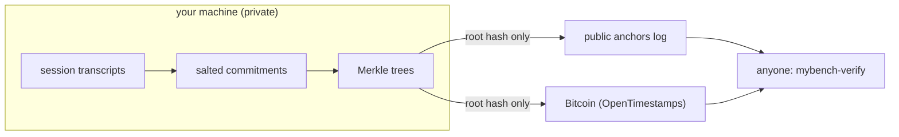
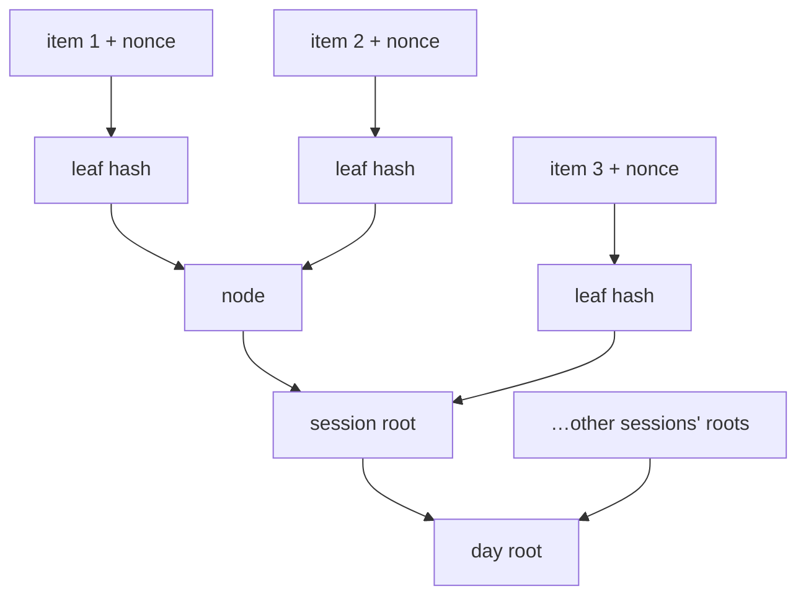
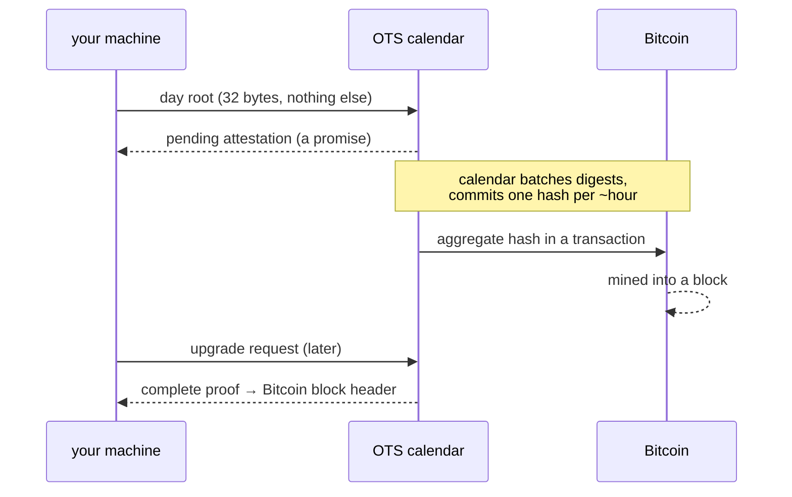
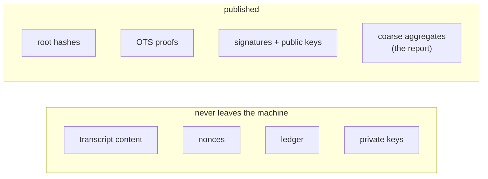

# How anchoring works

mybench proves **when** a developer's AI-agent work happened without
revealing **what** it was. This page explains the whole pipeline in plain
language. If you only remember one sentence: *mybench is a
certificate-transparency-style log for work history — a public Merkle log
with signed entries and independent, user-held Bitcoin timestamps — and you
can check all of it yourself with one command.*

```
uvx mybench-verify https://mybench.is/anchors
```

## The pipeline at a glance



Every line of every agent-session transcript is *committed* — fingerprinted
in a way that can be proven later but reveals nothing now. The fingerprints
roll up into one root hash per day. Only root hashes leave the machine:
once to a public git log, and once to Bitcoin via OpenTimestamps. From
those two trails, anyone can verify the history's timing and integrity —
without trusting the author, and without the author revealing a single line
of content.

## Step 1 — salted commitments (why the hashes reveal nothing)

A plain hash of a short line like `fix the tests` is guessable: an attacker
hashes likely strings until one matches. mybench therefore commits each
transcript line `m` together with a fresh 32-byte random **nonce**:

```
commitment = SHA-256( "mybench:v1:leaf" ‖ nonce ‖ length(m) ‖ m )
```

Guessing now requires guessing the nonce — 2²⁵⁶ possibilities even for a
one-word line. The nonces never leave the machine. But the author *keeps*
them, which enables **selective disclosure**: reveal one line plus its
nonce to someone, and they can recompute the commitment and check it
against the long-published root. Private by default, provable on demand,
one item at a time.

## Step 2 — Merkle trees (many items, one hash)



Leaf hashes pair up into nodes, nodes into a **session root**, session
roots into one **day root**. Publishing the single day root commits to
every item beneath it: change any line, any nonce, any ordering, and the
root changes. An *inclusion proof* — a handful of sibling hashes — lets a
disclosed item be checked against the root without revealing its
neighbors.

## Step 3 — the public log (one half of the timestamp)

Each day's root is written into the public anchors log as one small,
immutable file per identity per day, addressed by date:

```
anchors/<identity-id>/<YYYY>/<MM>/<DD>.json
```

The identity id is the fingerprint of the author's identity key
(self-certifying — the name *is* the key), with a human handle bound to it
by a signed record. Every anchor file states which rows of the author's
ledger it covers, and consecutive files must cover **contiguous** ranges —
so deleting inconvenient history leaves a visible hole. A day without a
file simply means "nothing anchored that day"; a *gap in the ranges* means
something was withheld. The two are distinguishable by design, which is the
property that makes the log more than a diary.

The private identity key, the local signed identity records, and the global log
are distinct. `mybench init` keeps private keys under the local data directory
and creates or verifies an offline signed genesis/current-device chain there.
That local chain is not registration and is not publication. Only a later,
explicit log-submission operation can ask the project-global log to accept the
public-candidate records. Normal users do not clone the anchors repository;
local report and preview flows read the canonical local chain. The one-time
founder-era exact-record migration is documented in
[Local identity state](local-identity-state.md).

## Step 4 — Bitcoin timestamps (the other half)



The root is also sent — just the 32 bytes — to OpenTimestamps calendar
servers. Hours later, once the calendar's aggregate lands in a mined
Bitcoin block, the proof **upgrades**: it now chains from the root to a
Bitcoin block header, and verifying it requires trusting *nothing but
Bitcoin consensus and open code*. Until then the anchor is honestly
labeled **pending (calendar-attested, not yet Bitcoin-confirmed)** — the
proof file is only published once confirmed, so a missing proof simply
means "check back in a few hours."

For local capture-health measurement, mybench privately remembers the clock
time immediately after the first calendar response successfully merges. That
self-attested observation is appended to the private ledger only after the
event and proof stage succeeds. It never enters the public event, proof, or
publish output, and it is deliberately distinct from the independently
verifiable Bitcoin block time. See [Private anchor receipts](private-anchor-receipts.md).

The two channels back each other up: the public log stops an author from
cherry-picking their own history; the author's locally-held Bitcoin proofs
stop the log's operator from censoring or losing it. Neither party needs
to be trusted with the other's guarantee.

## What leaves the machine — and what never does



Published bytes are a strict, schema-enforced whitelist, and every publish
passes a mandatory leak gate that scans the exact outgoing bytes against
every secret on the machine. No transcript content, prompt text, code,
filenames, or fine-grained timestamps are ever published — anchor files
carry dates, not times.

## What "verified" means (and honestly, what it doesn't)

- **PROVEN** claims are checkable from public artifacts and open code
  alone: the log's continuity, the signatures, the identity chain, and the
  Bitcoin timestamps. `mybench-verify` checks all of it in seconds,
  cross-checking block headers against two independent explorers.
- **ANCHORED** claims add the author's assertion about what the committed
  content *is* — provable per-item via selective disclosure, spot-checkable,
  but not proven wholesale.
- What anchoring **cannot** prove: that the transcripts describe real,
  original, unassisted work. A determined fabricator could anchor invented
  transcripts daily. The defense is longitudinal and economic — a history
  must be committed to in advance, consistently, bound to real public
  commits — never a cryptographic absolute, and mybench's reports say so
  on their face.

## Verify it yourself

```
uvx mybench-verify https://mybench.is/anchors
```

No account, no setup, no trust in the author, under a minute. The verifier
reads only public artifacts; its source is open and short by design.
